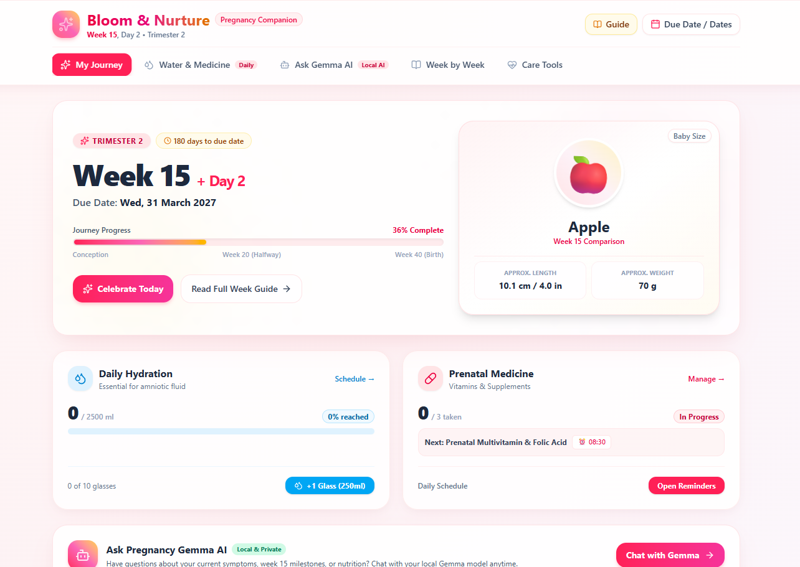
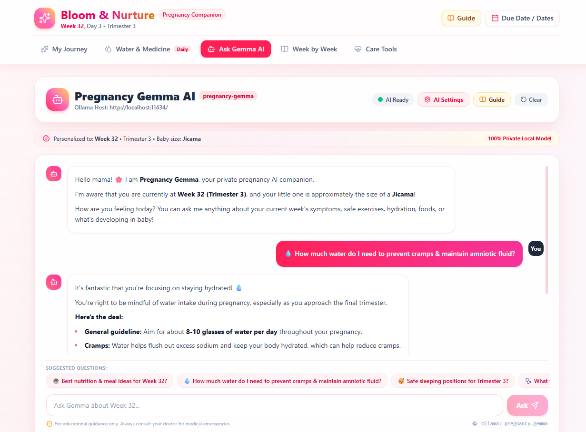
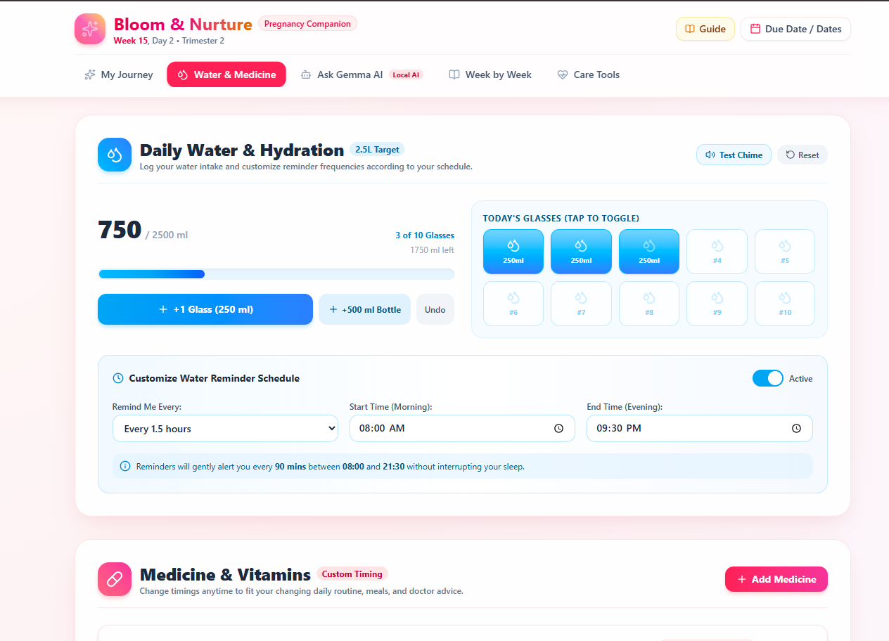
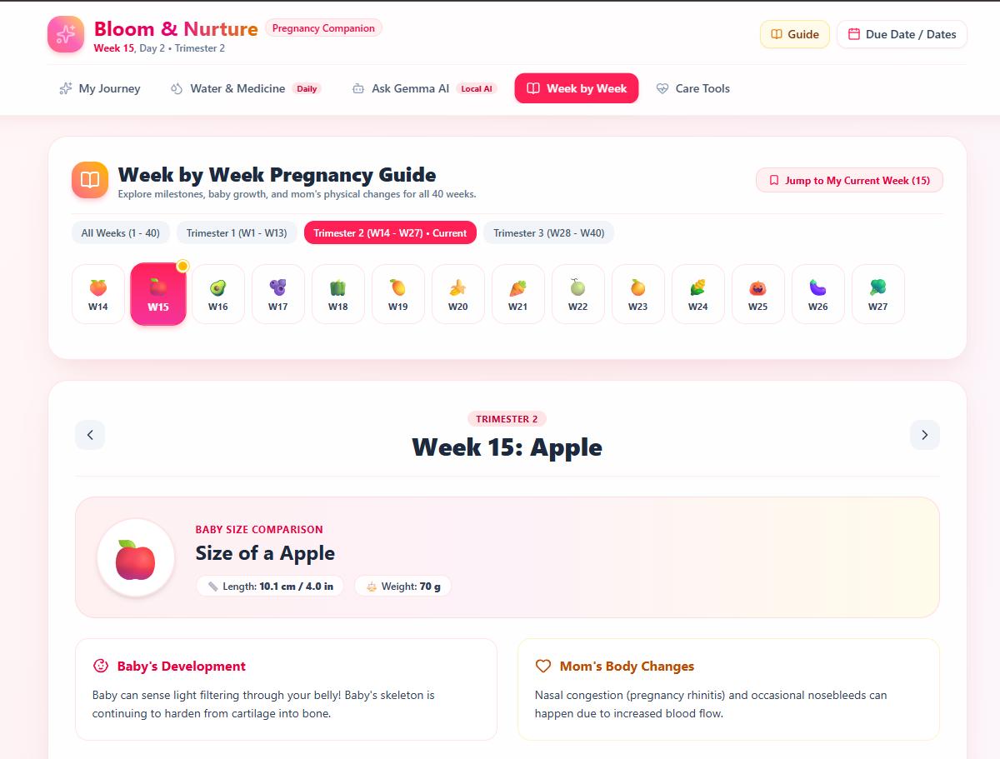
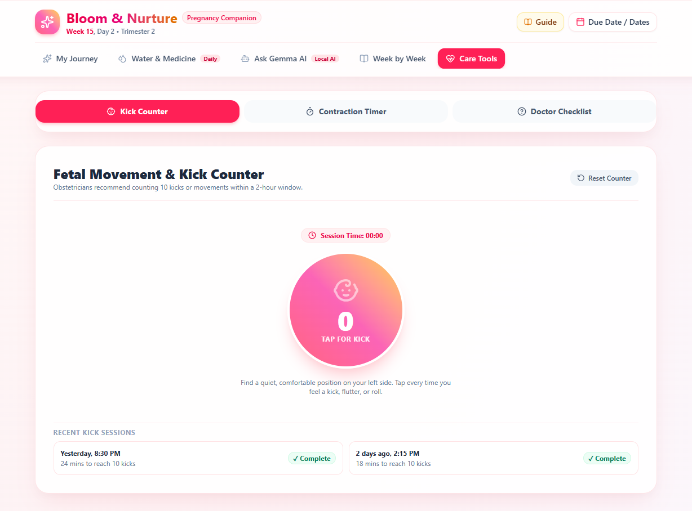

# 🌸 Bloom & Nurture — Pregnancy & Daily Wellness Companion

> A gentle, compassionate, and **100% private pregnancy companion** powered by open-source AI (**Google Gemma 2 via Ollama**). Built with love for an expectant friend at Week 15 (Trimester 2).

[](https://nextjs.org/)
[](https://react.dev/)
[-rose?logo=google)](https://ai.google.dev/gemma)
[](https://tailwindcss.com/)
[](https://pregnancy-sxq4.onrender.com/)
[](https://pregnancy-sxq4.onrender.com/)
[](#privacy--open-source-advantage)

🌐 **Live Web App**: [https://pregnancy-sxq4.onrender.com/](https://pregnancy-sxq4.onrender.com/)  
📦 **GitHub Repository**: [https://github.com/vimal-verma/bloom](https://github.com/vimal-verma/bloom)

---

## 📸 App Showcase

### 1. Daily Journey Dashboard (Week 15 • Apple 🍎)
*Personalized stage tracker with daily countdown, baby fruit size comparison, trimester progress bar, and today's schedule at a glance.*



---

### 2. Ask Gemma AI (Private Obstetric Companion)
*Tuned specifically with obstetric and maternal guidelines. Answers questions about symptoms, nutrition, and fetal development in clean, structured Markdown bullet points with medical safety disclaimers.*



---

### 3. Daily Hydration & Prenatal Medicine Tracker
*Helps prevent cramps and maintain amniotic fluid levels with interactive glass logging, customizable reminder schedules, soothing audio chimes, and prenatal vitamin checklists.*



---

### 4. Week-by-Week Visual Pregnancy Guide (Weeks 1 to 40)
*Automatically detects and centers on mom's active week. Explores baby anatomy milestones, maternal body changes, and practical self-care tips for every stage of pregnancy.*



---

### 5. Maternal Care Tools
*Practical peace-of-mind tools including a Fetal Movement & Kick Counter (2-hour window logging), a Contraction Timer with automatic clinical **5-1-1 Rule** triage indicator, and a Hospital Bag Checklist.*



---

## ✨ Key Features

- **🌸 Personalized Gestational Journey**: Automatically calculates gestational age, trimester, days to delivery, and baby's comparative fruit size (e.g. Apple at Week 15, Jicama at Week 32).
- **🤖 Ask Gemma AI Companion**:
  - Powered by **Google Gemma 2 (2B)** open weights running locally via Ollama (`pregnancy-gemma`).
  - Formatted with full **Markdown rendering** (clean headings, bold key concepts, organized bullet points).
  - Built-in obstetric guardrails advising immediate medical contact for red-flag symptoms (severe bleeding, vision changes, sudden swelling, or reduced fetal movement).
  - Dual provider support: **Local Ollama** (100% offline & private) or **Google Gemini 2.0 Flash** cloud connector with automatic model fallback for 24/7 web access.
- **💧 Smart Hydration Tracker**:
  - Daily progress ring and quick-add buttons (+250ml, +500ml).
  - Customizable quiet hours and reminder intervals (every 1 to 3 hours).
  - Soothing audio chimes when water targets are achieved.
- **💊 Prenatal Vitamin & Medicine Manager**:
  - Preloaded with essential prenatal vitamins (Multivitamins, Folic Acid, Calcium, Iron).
  - Easy toggle for taken status, customizable dosage timing, and active notification alerts.
- **📖 Complete 40-Week Guide**:
  - Full trimester filtering with auto-centering to the active week.
  - Detailed baby developmental facts (e.g., Week 15: baby senses light and bones harden from cartilage).
  - Maternal body symptoms and doctor-curated tips.
- **⏱️ Clinical Contraction Timer & Kick Counter**:
  - Measures contraction frequency and duration, calculating the hospital's **5-1-1 rule** (5 mins apart, lasting 1 min, for 1 hour).
  - Kick session counter logging 10 movements within a recommended 2-hour window.
- **🔒 100% Private by Default**:
  - No user accounts, passwords, or emails required.
  - All health logs, dates, and chats stay on your own device (`localStorage`).
  - No trackers, no advertisements, and no monetization of maternal health data.

---

## 🛠️ Technology Stack

| Layer | Technology |
|---|---|
| **Framework** | [Next.js 16](https://nextjs.org/) (App Router, Turbopack) |
| **UI Library** | [React 19](https://react.dev/) |
| **Styling** | [Tailwind CSS v4](https://tailwindcss.com/) with custom glassmorphism design tokens |
| **Icons** | [Lucide React](https://lucide.dev/) |
| **Local AI Engine** | [Google Gemma 2:2b](https://ai.google.dev/gemma) running on [Ollama](https://ollama.com/) |
| **Markdown Engine** | [react-markdown](https://github.com/remarkjs/react-markdown) with custom Tailwind components |
| **Cloud Deployment** | [Render](https://render.com/) via declarative `render.yaml` blueprint |
| **Audio** | HTML5 Audio synthesis / chimes for hydration and vitamin reminders |

---

## 🚀 Quick Start (Local Setup)

### 1. Clone the Repository
```bash
git clone https://github.com/vimal-verma/bloom.git
cd bloom
```

### 2. Install Dependencies
```bash
npm install
```

### 3. Setup Local AI (Ollama + Gemma 2)
Make sure [Ollama](https://ollama.com/) is installed and running on your machine:

```bash
# Pull the base open-weight model
ollama pull gemma2:2b

# Create the customized pregnancy companion model from the included Modelfile
ollama create pregnancy-gemma -f ./Modelfile

# Verify the model is ready
ollama run pregnancy-gemma "Hello, who are you?"
```

### 4. Run the Development Server
```bash
npm run dev
```

Open [http://localhost:3000](http://localhost:3000) in your browser.

---

## 🌐 Deploying to Render

This project includes a ready-to-use [`render.yaml`](render.yaml) blueprint:

1. Push your repository to GitHub.
2. In the [Render Dashboard](https://dashboard.render.com/), choose **New > Blueprint** and select this repo.
3. Configure the optional environment variables:
   - `OLLAMA_HOST`: Your remote Ollama endpoint or Ngrok tunnel (e.g. `https://xxxx.ngrok-free.app`).
   - `GEMINI_API_KEY`: *(Optional)* Your Google AI Studio API key for cloud fallback mode.
4. Click **Apply**—Render will build and deploy the Next.js application automatically!

---

## 💡 Tunneling Ollama to Mobile or Render

To connect your laptop's local Ollama instance to a deployed Render site or mobile device:

```bash
# Run ngrok with host-header rewrite to bypass Ollama's 403 CORS check:
npx ngrok http 11434 --host-header="localhost"
```

Copy the generated `https://xxxx.ngrok-free.app` URL and paste it into **AI Settings ⚙️ > OLLAMA_HOST URL** inside the app.

---

## 🏆 Hacktoberfest 2026 Weekend Challenge

This project was built for the **[Hacktoberfest Weekend Challenge: Build for a Friend](https://dev.to/challenges/hacktoberfest-weekend-2026-10-01)**.

### Target Prize Categories:
- **🌟 Best Use of Gemma**: Fine-tuned **Google Gemma 2 (2B)** open weights using an Ollama `Modelfile` to build a 100% private, empathetic obstetric AI assistant.
- **🚀 Best Use of Render**: Native Next.js 16 deployment with zero-config `render.yaml` blueprint, edge SSR, and dual-mode AI streaming.

---

## 📄 License

This project is licensed under the [MIT License](LICENSE).
